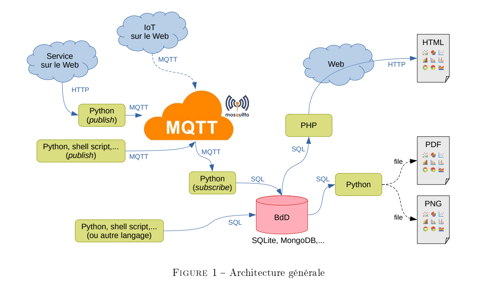

# SAE-23
SAE203 - Mettre en place une solution informatique pour l’entreprise

Architecture du projet

-Lien sympa : 

https://raspberrypi.pagesperso-orange.fr/dossiers/23-08.htm

- [x] Dire bonjour et envoyer du json mqtt
  
- [x] Recuperer les donnees et upload sur une BDD
  
- [x] Faire un graphique avec les infos avec php aussi python dynamiquement bien sur
  
[] Possibilite de PDF's (a moitie fait)